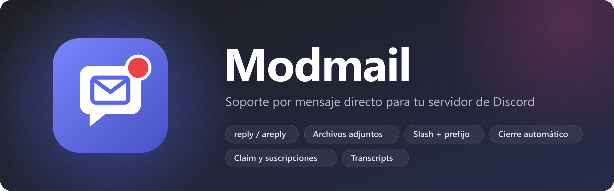
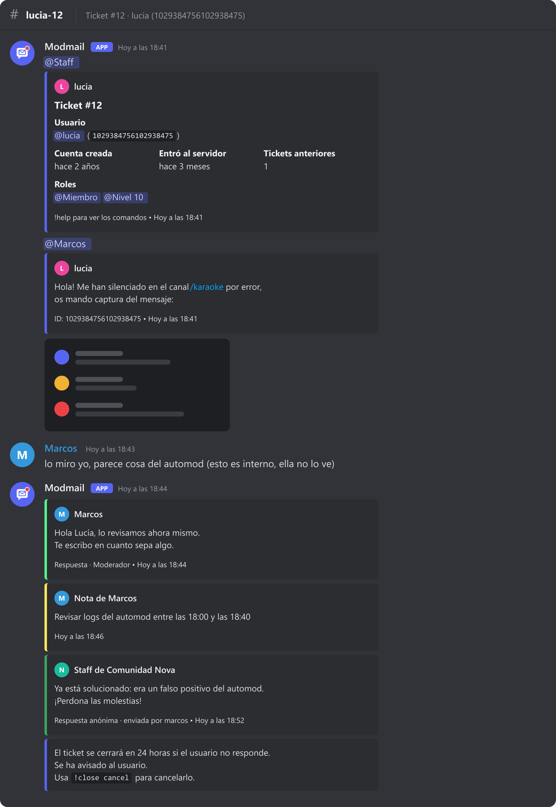
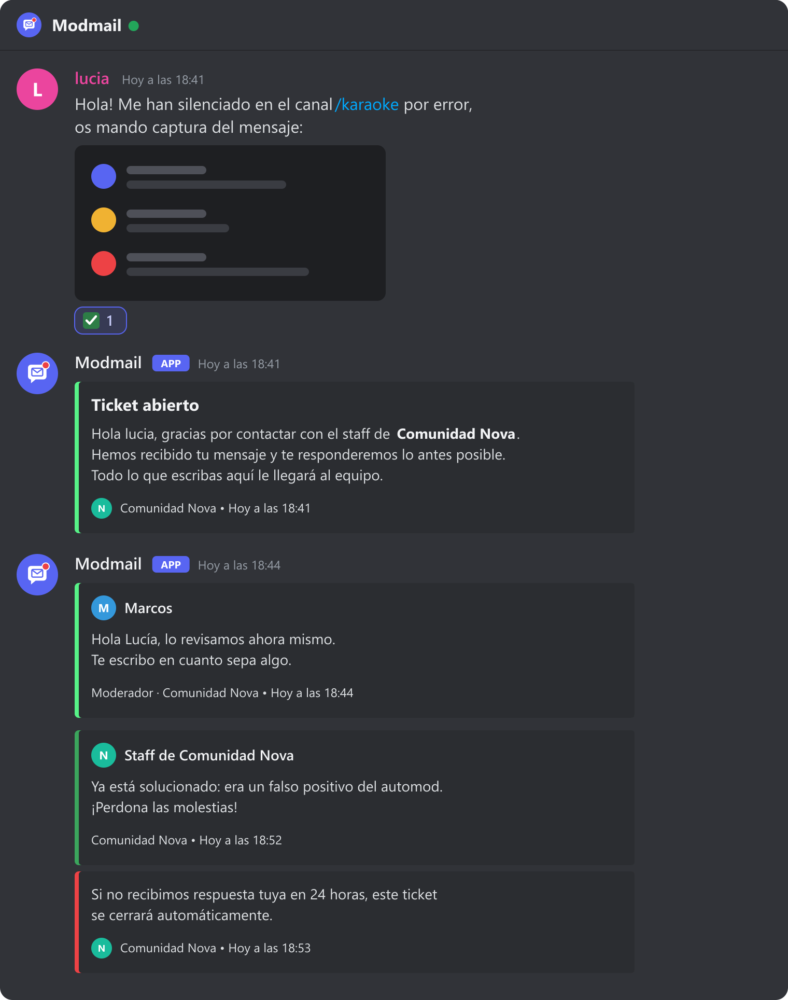
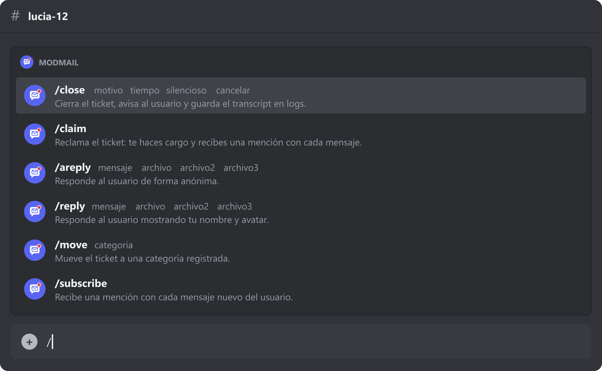

<div align="center">



<br>


<br><br>

**Los usuarios escriben al bot por MD → se abre un ticket en un canal que solo ve el staff → el staff responde desde ahí.**

[Características](#-características) ·
[Capturas](#-capturas) ·
[Instalación](#-instalación) ·
[Comandos](#-comandos) ·
[Personalización](#-personalización) ·
[Preguntas frecuentes](#-preguntas-frecuentes)

</div>

---

## ✨ Características

<table>
<tr>
<td width="50%" valign="top">

### 💬 Responder como prefieras
`reply` firma con tu nombre y avatar.
`areply` responde **de forma anónima**: el usuario ve el nombre del equipo, pero en el canal queda quién lo envió.

</td>
<td width="50%" valign="top">

### 📎 Archivos de verdad
Imágenes, vídeos y documentos se **descargan y se vuelven a subir** en los dos sentidos.
No se quedan enlaces que caducan.

</td>
</tr>
<tr>
<td valign="top">

### 🔒 Canal solo para el staff
El usuario nunca ve el canal del ticket: habla solo por MD.
Todo lo que escribes **sin prefijo** es interno: puedes hablar con tu equipo sin que el usuario lo vea.

</td>
<td valign="top">

### 🙋 Claim y suscripciones
Reclama un ticket para hacerte cargo o suscríbete para recibir una mención con cada mensaje nuevo, aunque no lo hayas reclamado.

</td>
</tr>
<tr>
<td valign="top">

### 📂 Categorías
Registra categorías como `admin` o `soporte` y mueve tickets entre ellas con `move`.
Cada categoría puede tener sus propios roles.

</td>
<td valign="top">

### ⏰ Cierre automático
`close 24h` cierra el ticket si el usuario no responde a tiempo.
Si escribe antes, se cancela solo. Sobrevive a reinicios.

</td>
</tr>
<tr>
<td valign="top">

### ⛔ Blacklist
Impide que alguien abra tickets, de forma **permanente o temporal** (`block @user 7d`).
Los bloqueos temporales caducan solos.

</td>
<td valign="top">

### ⚡ Slash y prefijo
Usa `/reply` o `!r`, o activa solo uno de los dos desde el `.env`.
Los slash autocompletan categorías y snippets.

</td>
</tr>
<tr>
<td colspan="2" valign="top">

### 🎨 Todo personalizable
Mensajes, colores de cada embed, nombre anónimo, prefijo, roles de staff y rol al que avisar. Todo desde comandos, sin tocar código.

</td>
</tr>
</table>

Y además: **notas internas**, **snippets** (respuestas guardadas), **editar o borrar** tu última respuesta, abrir tickets con `contact` y **transcripts** `.txt` de cada ticket en el canal de logs.

---

## 📸 Capturas

> Maquetas generadas a partir de los mensajes reales que envía el bot.

<table>
<tr>
<th width="54%">Lo que ve el staff</th>
<th width="46%">Lo que ve el usuario</th>
</tr>
<tr>
<td valign="top"></td>
<td valign="top"></td>
</tr>
</table>

<details>
<summary><b>Comandos slash</b></summary>
<br>

</details>

---

## 🚀 Instalación

### 1. Crea el bot

1. Entra en el [Discord Developer Portal](https://discord.com/developers/applications) → **New Application**.
2. En **Bot**:
   - Pulsa **Reset Token** y guárdalo.
   - Activa **Message Content Intent** (solo hace falta si usas comandos con prefijo).
   - Si quieres, pon [`assets/logo.png`](assets/logo.png) como avatar.
3. En **OAuth2 → URL Generator** marca `bot` y `applications.commands`. Elige uno de estos permisos:
   - **Administrator**, la opción más sencilla.
   - Los permisos mínimos: *Gestionar canales, Gestionar roles, Ver canales, Enviar mensajes, Insertar enlaces, Adjuntar archivos, Leer historial, Gestionar mensajes y Añadir reacciones*.

### 2. Configura y arranca

```bash
npm install
cp .env.example .env   # en Windows: copy .env.example .env
npm start
```

| Variable | Descripción |
|---|---|
| `DISCORD_TOKEN` | Token del bot |
| `GUILD_ID` | ID del servidor (activa el *modo desarrollador* de Discord para copiarlo) |
| `MONGODB_URI` | Conexión a MongoDB, local (`mongodb://127.0.0.1:27017/modmail`) o [Atlas](https://www.mongodb.com/atlas) |
| `SLASH` | `true` / `false`: comandos slash. Por defecto, `true` |
| `PREFIX` | `true` / `false`: comandos con prefijo. Por defecto, `true` |

### 3. Prepara el servidor

```
!config staff add @Staff
!config staff add @Moderador
!setup
```

`setup` crea la categoría **📬 Modmail** y el canal **#modmail-logs**, visibles solo para el staff. ¡Y listo! 🎉

---

## 📖 Comandos

> Todos funcionan con prefijo (`!reply`) y como slash (`/reply`). En la tabla se muestran con prefijo.

### En un ticket

| Comando | Alias | Qué hace |
|---|---|---|
| `reply <mensaje>` | `r` | Responde al usuario con tu nombre y avatar |
| `areply <mensaje>` | `ar` | Responde de forma **anónima** |
| `s <snippet>` · `as <snippet>` | | Envía una respuesta guardada (normal o anónima) |
| `edit <texto>` · `delete` | `del` | Edita o borra tu última respuesta |
| `note <texto>` | `n` | Nota interna (queda en el transcript) |
| `claim` · `unclaim` | | Hacerte cargo del ticket o liberarlo |
| `subscribe` · `unsubscribe` | `sub` · `unsub` | Recibir o dejar de recibir menciones |
| `move <categoría>` | `mv` | Mover a otra categoría (`default` para volver) |
| `close [silent] [motivo]` | `c` | Cerrar ahora |
| `close [silent] <duración> [motivo]` | | Cerrar si el usuario no responde: `24h`, `2d`, `1h30m`… |
| `close cancel` | | Cancelar el cierre programado |

### Staff

| Comando | Alias | Qué hace |
|---|---|---|
| `help` | | Lista de comandos |
| `contact <@usuario>` | | Abrir un ticket con alguien |
| `tickets` | | Ver los tickets abiertos |
| `block [@usuario] [duración] [motivo]` | `blacklist` · `bl` | Añadir a la **blacklist**. Sin duración es permanente |
| `unblock [@usuario]` | `unblacklist` · `unbl` | Quitar de la blacklist |
| `blocklist` | `bllist` | Ver la blacklist con motivo y fecha de fin |
| `snippet add\|edit\|remove\|list` | | Gestionar respuestas guardadas |

<details>
<summary><b>⛔ Cómo funciona la blacklist</b></summary>

```
!block @usuario spam                 ← permanente
!block @usuario 7d insultos al staff ← temporal: se quita sola en 7 días
!block 12h                           ← dentro de un ticket: bloquea a su usuario
!unblock @usuario
```

- Un usuario en la blacklist **no puede abrir tickets**, y sus mensajes no llegan al staff aunque tenga uno abierto.
- Recibe el mensaje `blocked` con el motivo y la fecha de fin, como mucho **una vez por hora**, para que no pueda usar al bot para hacer spam.
- Los bloqueos temporales caducan solos. Los gestiona MongoDB, así que no se pierden aunque reinicies el bot.
- No se puede bloquear a miembros del staff ni a bots.
- Cada bloqueo y desbloqueo queda registrado en el canal de logs.

</details>

### Administración · requiere *Gestionar servidor*

| Comando | Qué hace |
|---|---|
| `setup` | Crear la categoría de tickets y el canal de logs |
| `config` | Ver la configuración (`config help` muestra todas las opciones) |
| `config staff add\|remove\|list <@rol>` | Roles de staff |
| `config prefix <x>` · `config logs <#canal\|off>` · `config category <ID>` | Ajustes básicos |
| `config ping <@rol\|off>` | Rol al que mencionar cuando se abre un ticket |
| `config message <clave> <texto\|reset>` · `config messages` | Mensajes personalizados |
| `config color <clave> <#hex\|reset>` · `config color` | Colores de los embeds |
| `category create <nombre> [ID] [@roles]` · `category delete` · `category list` | Categorías para `move` |

<details>
<summary><b>Usar los comandos slash</b></summary>

- Las respuestas del bot al staff son **efímeras** (solo las ves tú). Lo que va al usuario o al canal se publica igual.
- Las opciones de slash no admiten saltos de línea. Escribe `\n` y se convierte en uno.
- `/reply` y `/areply` tienen las opciones `archivo`, `archivo2` y `archivo3`.
- `s` y `as` se llaman `/snip` y `/asnip`.
- `/move`, `/snip`, `/asnip` y `/snippet` **autocompletan** los nombres.
- `/close` tiene las opciones `motivo`, `tiempo`, `silencioso` y `cancelar`. `/block` tiene `usuario`, `motivo` y `duracion`.

</details>

---

## 🎨 Personalización

### Mensajes

```
!config message greeting ¡Hola {user}! Gracias por escribir a {server}, enseguida te atendemos.
!config message anonName Equipo de {server}
!config message greeting reset
```

| Clave | Cuándo se usa |
|---|---|
| `greetingTitle` · `greeting` | Al abrir un ticket |
| `closingTitle` · `closing` | Al cerrarlo |
| `autoClose` | Al programar un cierre automático (`{time}` = cuándo se cierra) |
| `anonName` | Nombre que aparece en las respuestas anónimas |
| `blocked` | Cuando escribe un usuario de la blacklist (se añaden el motivo y la fecha de fin) |

Variables: `{user}` (mención), `{username}` y `{server}`. Los snippets también admiten `{staff}`.

### Colores

```
!config color staff #ff8800
!config color anon reset
```

Claves: `user` · `staff` · `anon` · `note` · `greeting` · `closing` · `blocked` · `info` · `success` · `error` · `system`

### Categorías con permisos propios

```
!category create admin @Administrador     ← crea una categoría que solo ve ese rol
!move admin                               ← dentro de un ticket
!move default                             ← lo devuelve a la principal
```

---

## ❓ Preguntas frecuentes

<details>
<summary><b>¿Qué pasa con los archivos muy grandes?</b></summary>

Se vuelven a subir siempre que quepan en el límite de Discord:
- 10 MB en MD.
- 10, 50 o 100 MB en el servidor, según el nivel de mejoras.

Si no caben, se mandan como enlace. En ese caso el bot no borra tu mensaje original, para que el enlace siga funcionando.

</details>

<details>
<summary><b>¿Puedo escribir mensajes con <code>/</code>, comillas o varias líneas?</b></summary>

Sí. Del comando solo se separa el nombre, y el resto se envía tal cual: `!r mira el canal /normas` funciona perfectamente.

</details>

<details>
<summary><b>¿Quién ve las respuestas anónimas?</b></summary>

El usuario ve el nombre de `anonName` y el icono del servidor. En el canal del ticket el staff ve quién la envió, y queda registrado en el transcript.

</details>

<details>
<summary><b>¿Y si alguien borra el canal de un ticket a mano?</b></summary>

El ticket se marca como cerrado y el transcript se envía al canal de logs igualmente. Si el usuario vuelve a escribir, se abre uno nuevo.

</details>

<details>
<summary><b>¿Se pierden los cierres programados o los bloqueos temporales si reinicio el bot?</b></summary>

No. Los dos se guardan en MongoDB. Los cierres que vencieron mientras el bot estaba apagado se ejecutan al arrancar, y los bloqueos caducados se eliminan solos.

</details>

---

## 🗂️ Estructura

```
src/
├── index.js          Arranque, eventos y conexión a MongoDB
├── tickets.js        Lógica de tickets: MD, respuestas, cierre, transcripts
├── commands/
│   ├── index.js      Despachador común para prefijo y slash
│   ├── tickets.js    reply, areply, claim, move, close…
│   ├── staff.js      help, contact, blacklist, snippets…
│   └── admin.js      setup, config, category
├── slash.js          Adaptador de interacciones y utilidades de slash
├── config.js         Configuración y mensajes por defecto
├── models.js         Esquemas de MongoDB
├── util.js           Embeds, colores, permisos y adjuntos
└── env.js            Interruptores SLASH / PREFIX
assets/               Logo, banner y capturas del README
```

<div align="center">
<br>

<br>
<sub>Hecho con discord.js y MongoDB</sub>
</div>
